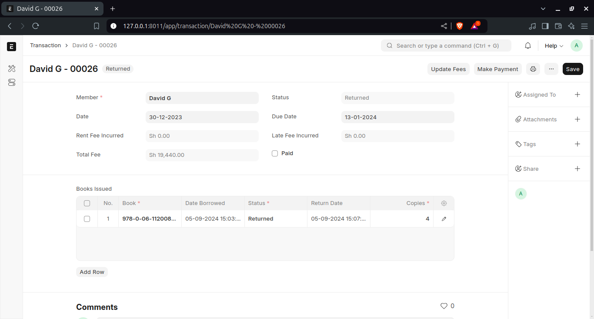
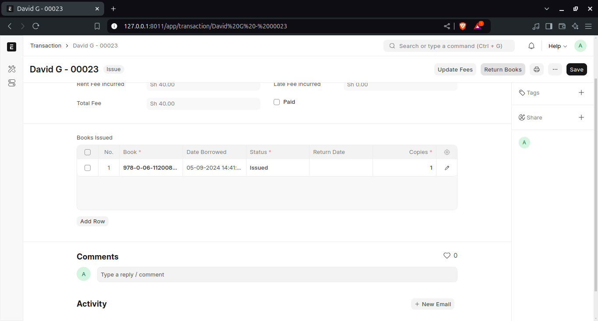
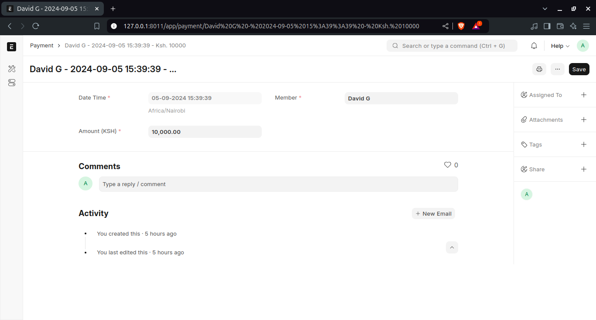
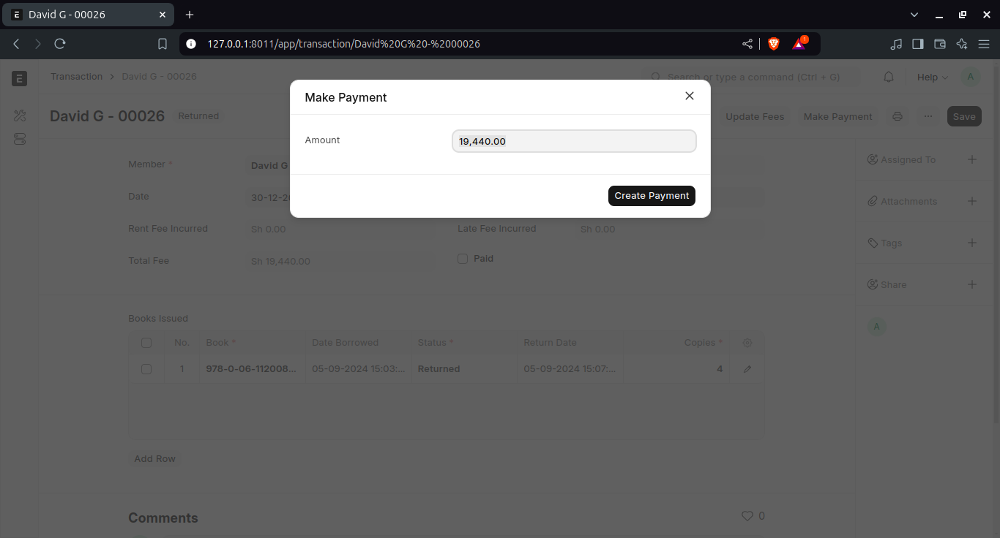
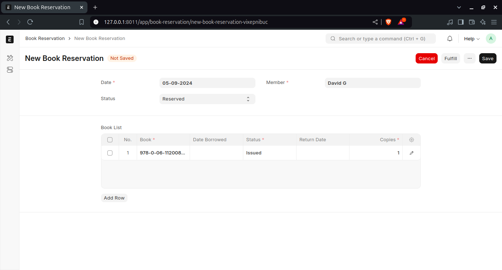
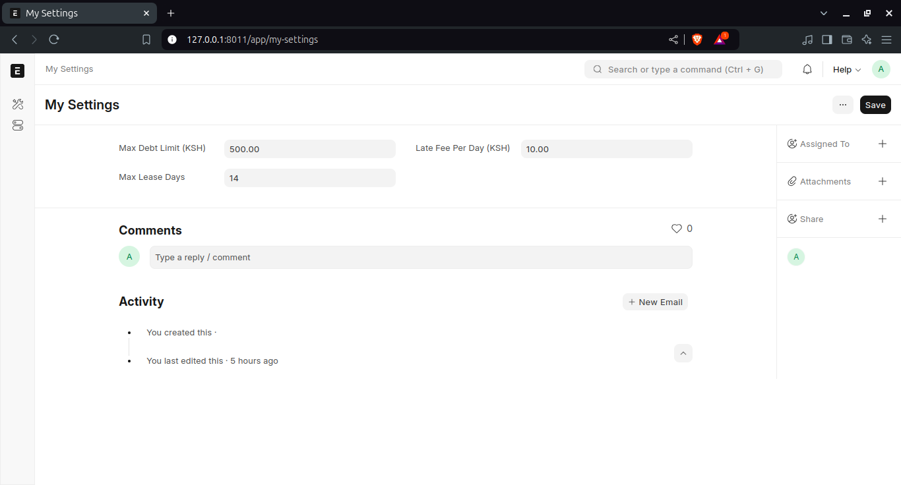

# Library Management System

## Introduction

The **Library Management System** is a web application developed on the **Frappe Framework** and **ERPNext** platform, providing a robust toolset to manage the operations of a library. It facilitates the management of book inventories, member tracking, transactions (borrow/return), and financial oversight, including rental and late fee collection.

## Features

### Core Functionalities

#### Book Management

- Add, update, and delete books in the system.
- Real-time inventory management.
- Categorize books by genres, authors, and tags for efficient searching.
- Track the status of books (available, issued, or reserved).

#### Member Management

- Register and manage library members.
- Track borrowing history and debts.

#### Transaction Management

- Issue and return books, with automated calculation of rental fees.
- Monitor outstanding debts and restrict further borrowing for members with overdue payments.

#### Book Search and Reservation

- Advanced search functionality with filters based on title, author, ISBN, genre, and tags.
- Reservation system for books currently unavailable.

#### Settings and Configurations

- Define limits (e.g., maximum borrowable books, debt limits, late fees).

### Advanced Functionalities

#### Borrowing History Tracking

- Keep detailed logs of each book transaction, tracking fees, return status, and due dates.

#### Automated Fee Calculations

- Automatically calculate rental and late fees based on book return dates.

#### Member Debt Monitoring

- Real-time monitoring of member debts and notification alerts when their dues exceed the allowed limit.

## System Flow

### 1. Book Management

- **Add New Book**: The librarian inputs details such as title, author, ISBN, and quantity. The system updates the inventory automatically when books are issued or returned.

### 2. Member Management

- **Register Member**: Capture member details, assign membership categories, and define borrowing privileges.

### 3. Transaction Management

- **Issue Books**: Select the book and member, set the due date, and calculate the fee.
- **Return Books**: Track the return and update the inventory automatically. Late fees are calculated based on the return date.

### 4. Reservation Management

- **Reserve Book**: Members can reserve books that are currently issued, and the system will notify them when the book is available.

### 5. Settings and Configuration

- **Set Limits**: Define borrowing limits, late fees, and the number of books a member can borrow based on their membership type.

### 6. Reporting and Analytics

- Generate comprehensive reports on book usage, member activity, and financial transactions.

## Process Guide

### 1. Adding a Book

1. Go to the **Books** list.
2. Click on **New Book**.
3. Fill in the details (e.g., title, author, ISBN, quantity, etc.).
4. Click **Save** to add the book.

**Screenshot:**

---

### 2. Registering a Member

1. Go to the **Members** list.
2. Click on **New Member**.
3. Enter the member's details (e.g., name, membership type, contact info).
4. Click **Save** to register the member.

**Screenshot:**

---

### 3. Issuing a Book

1. Go to the **Transactions** list.
2. Click on **New Transaction**.
3. Choose **Issue** as the transaction type.
4. Select the book and member, set the due date, and click **Save**.

**Screenshot:**

---

### 4. Returning a Book

1. Go to the **Transactions** list.
2. Find the relevant transaction for the book.
3. Click on **Return Book**.
4. The system will automatically calculate any late fees and update the book's status to available.

**Screenshot:**

---

### 5. Making a Payment

1. After returning the book, go to the **Transactions** list.
2. Select the relevant transaction.
3. Click on **Make Payment**.
4. Enter the payment amount and click **Save** to complete the payment.

**Screenshot:**

---

### 6. Reserving a Book

1. Go to the **Books** list and search for the desired book.
2. Click on **Reserve Book**.
3. Select the member and save the reservation.

**Screenshot:**

---

### 7. Managing Settings

1. Go to **My Settings**.
2. Update settings such as maximum debt limits, late fees, notification preferences, etc.
3. Click **Save** to apply changes.

**Screenshot:**

---

## Conclusion

The **Library Management System** is designed to streamline the daily operations of a library. With intuitive features for managing books, members, transactions, and reservations, the system helps libraries operate more efficiently. The advanced reporting and analytics capabilities provide insights into borrowing trends, financial transactions, and inventory, allowing for data-driven decision-making.
